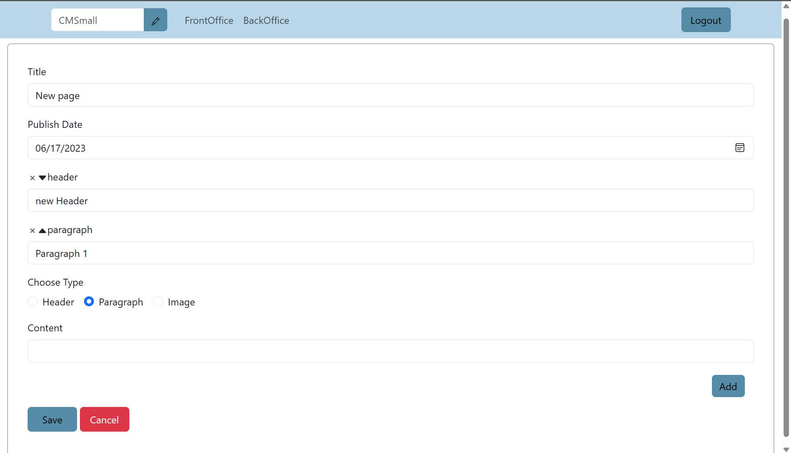

# Exam #1 : "CMSmall"

## Student: s306979 INAAM ELHELWE 

# Server side

## API Server

### API Server

- GET `/api/sessions`
  - request: include credentials
  - response: `200` and current use or `401` if unauthorized 
- POST `/api/sessions`
  - request: user
  - response: `200` and requested user or `401` if unauthorized
- DELETE `/api/sessions`
  - request: -
  - response: `200`

- GET `/api/users`
  - request: - include credentials
  - response: `200` list of users or `400` unauthorized

### API Pages

- GET `/api/pages/all`
  - request: -
  - response: `200` list of all published pages
- GET `/api/pages/mypages`
  - request: - include credentials
  - response: `200` list all created pages `400` unauthorized
- POST `/api/mypages`
  - request: page and blocks - include credentials
  - response: `200` new page is added or `400` if constrained not satisief or unauthorized user
- DELETE `/api/pages/:pageid`
  - request: - include credentials
  - response: `200` or `400` unathorized user or constraints not met
- PUT `/api/pages/:pageid`
  - request: pageo object - include credentials
  - response: `200` or `400`if does not specify constraint or unauthorized

### API Blocks

- GET `/api/pages/:pageid/blocks`
  - request: -
  - response: `200` list of blocks 

- GET `/api/mypages/:pageid/blocks`
  - request: - include credentials
  - response: `200` or `400` if unauthorized

- PUT `/api/pages/:pageid/:blockid`
  - request: new content - include credentials
  - response: `200` or `400` if empty content or unauthorized

- POST `/api/mypages/:pageid`
  - request: object block - include credentials
  - response: `200` oe `400` if unauthorized or empty content

- DELETE `/api/mypages/:pageid/:blockid` 
  - request: - include credentials
  - response: `200` 
- PUT `/api/pages/:pageid/:blockid/move`
  - request: boolean indicating direction
  - response: `200` or `400` if unauthorized

### Website Name

- POST `/api/websitename`
  -request:  - include credentials
  - response body content : `200` or `400` unauthorized
- GET `/api/websitename`
  - no request parameters
  - no response body content

## Database Tables

- Table `users` - contains the id , username, email, password, role, salt of a user
- Table `pages` - contanis id, username, title, creationDate, publishDate of a page
- Table `blocks` - contains id, username, pageId, typ, content, rank of a block
- Table `webName` - contains the name of the application webName

# Client side

## React Client Application Routes

- Route `/`: the front office of the application has all the published pages
- Route `/home`:the backoffice of the application, in this page I implemented all the functionalities done by a logged in user
- Route `/login`: the login page 

## Main React Components

- `PagesList` (in `FrontOffice.jsx`): list of all published pages
- `PageCard` (in `Frontoffice.jsx`): the page info are published here
- `BackPageList` (in `BackOffice.jsx`): list of all created pages 
- `FormPage` (in `BackOffice.jsx`) : this form is used for editing a page or adding a new one depending on the mode 
(only _main_ components, minor ones may be skipped)
- `AddBlockForm` (in `BackOffice.jsx` ) : form for adding a new Block
- `BlockForms` (in `BackOffice.jsx` ) : form for each block 
# Usage info

## Example Screenshot

### BackOffice for user logged in as admin

### FrontOffice for user not logged in

### Adding a page Form

### Page

## Users Credentials

- user1@polito.com , user1password
- user2@polito.com , 123
- admin@polito.com , 123
